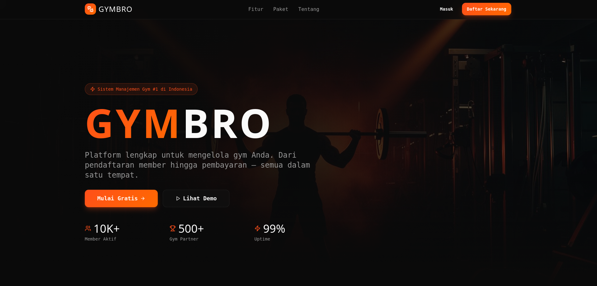

# GYMBRO - Gym Management Platform

A modern gym management platform built with React, TypeScript, and Tailwind CSS.



## 🏋️‍♂️ Features

- **Modern UI/UX**: Clean and responsive design using Tailwind CSS and shadcn/ui components
- **User Authentication**: Secure login and registration system
- **Dashboard**: Comprehensive gym management dashboard
- **Package Management**: Manage gym memberships and packages
- **Responsive Design**: Works seamlessly on desktop and mobile devices.

## 🛠️ Tech Stack

- **Frontend**: React 18 with TypeScript
- **Build Tool**: Vite
- **Styling**: Tailwind CSS
- **UI Components**: shadcn/ui
- **Backend**: Supabase (Authentication & Database)
- **Package Manager**: npm/bun

## 🚀 Getting Started

### Prerequisites

- Node.js (v18 or higher)
- npm or bun package manager

### Installation

1. Clone the repository:
```bash
git clone <YOUR_GIT_URL>
cd GYMBRO
```

2. Install dependencies:
```bash
npm install
# or
bun install
```

3. Set up environment variables:
```bash
cp .env.example .env
```

4. Fill in your environment variables in `.env`:
```
VITE_SUPABASE_PROJECT_ID="your_supabase_project_id"
VITE_SUPABASE_PUBLISHABLE_KEY="your_supabase_publishable_key"
VITE_SUPABASE_URL="https://your-project-id.supabase.co"
```

5. Start the development server:
```bash
npm run dev
# or
bun dev
```

The application will be available at `http://localhost:5173`

## 📁 Project Structure

```
GYMBRO/
├── public/                 # Static assets
│   └── GYMBRO-Landingpage.png
├── src/
│   ├── components/         # Reusable components
│   │   ├── landing/        # Landing page components
│   │   └── ui/             # shadcn/ui components
│   ├── hooks/              # Custom React hooks
│   ├── integrations/       # Third-party integrations
│   │   └── supabase/       # Supabase client and types
│   ├── lib/                # Utility functions
│   ├── pages/              # Page components
│   └── test/               # Test files
├── supabase/               # Database migrations and config
└── .env.example            # Environment variables template
```

## 🔧 Development

### Available Scripts

- `npm run dev` - Start development server
- `npm run build` - Build for production
- `npm run preview` - Preview production build
- `npm run test` - Run tests

### Environment Variables

The project uses environment variables for configuration. See `.env.example` for all required variables.

## 🚀 Deployment

### Deploy with GYMBRO

1. Open [GYMBRO](https://gymbro.dev/projects/REPLACE_WITH_PROJECT_ID)
2. Click on Share → Publish

### Deploy to Vercel

1. Push your code to GitHub
2. Connect your repository to Vercel
3. Set environment variables in Vercel dashboard
4. Deploy

### Custom Domain

To connect a custom domain:
1. Navigate to Project > Settings > Domains in GYMBRO
2. Click Connect Domain
3. Follow the instructions

Read more: [Setting up a custom domain](https://docs.gymbro.dev/features/custom-domain#custom-domain)

## 🤝 Contributing

1. Fork the repository
2. Create a feature branch (`git checkout -b feature/amazing-feature`)
3. Commit your changes (`git commit -m 'Add some amazing feature'`)
4. Push to the branch (`git push origin feature/amazing-feature`)
5. Open a Pull Request

## 📝 License

This project is licensed under the MIT License.

## 🆘 Support

If you need help or have questions:
- Create an issue in this repository
- Contact the GYMBRO support team

---

Built with ❤️ using [GYMBRO](https://gymbro.dev)
